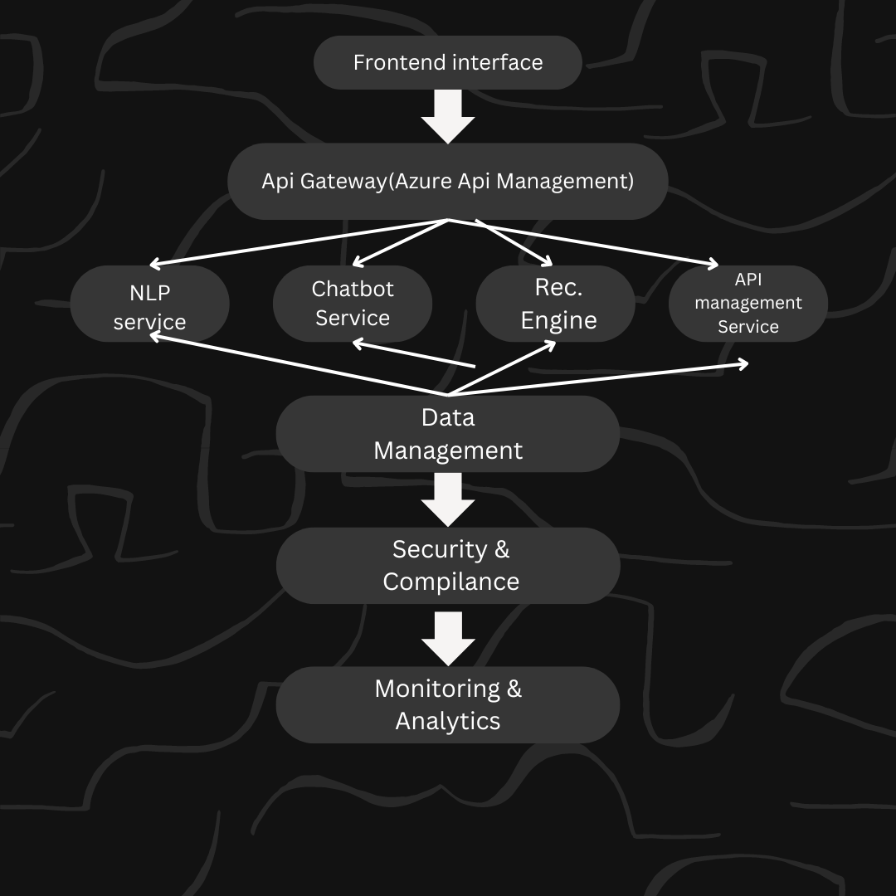

# Banking chatbot (Rasa framework-based)

## Features
- Intent analysis and the ability to extract and save all the entities during the conversation with a user
- Communication on banking topics such as mortgages, deposit accounts and credit cards
- The ability to estimate user creditworthiness by means of database appending with the information that a user provides
- Automatic fullfilment of the official documents that are necessary for mortgage application
- Custom actions that can form queries from user messages and return the documents by index and query using ElasticSearch

